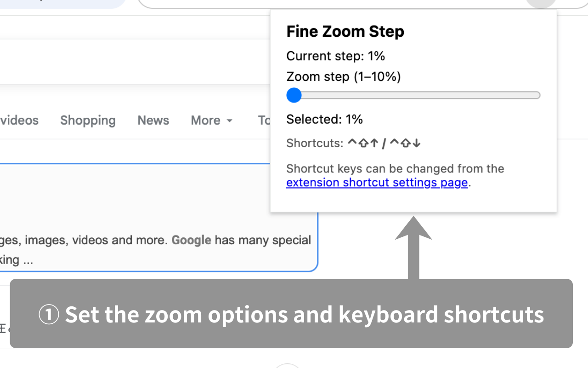

# Zoom Browser By Fine Step

[](./LICENSE)

## Overview

Fine Zoom Step brings fine-grained zoom control to Chrome with a simple popup slider and keyboard shortcuts that respect your preferred increment.

- Select a zoom step between 1% and 10% in the popup and store it in Chrome Sync storage.
- Use shortcut keys (Ctrl+Shift+Up / Ctrl+Shift+Down) to zoom in small increments without opening the menu.
- Open the shortcut settings page from the popup when you need to remap any commands or inspect the defaults.

This is an open-source extension implemented based on Chrome Extension Manifest v3.

---

## Features

- **Adjustable zoom increments**: Slide a range input to pick how aggressive each zoom step should be (1–10%) and persist it across devices.
- **Keyboard shortcuts**: Fine zoom in/out commands land on `Ctrl+Shift+Up` and `Ctrl+Shift+Down` (or the macOS equivalents) for quick access.
- **Popup controls**: The popup surfaces the current and selected zoom step plus a link to Chrome’s shortcut settings so you can inspect or change bindings.
- **Safe zoom range**: Zoom values stay clamped between Chrome’s safe range (0.3x–5.0x) to avoid unusable zoom levels.
- **Manifest v3 friendly**: Background scripts, storage, and commands are handled through a service worker and the official Chrome APIs.

---

## Screenshots

| Screen                                          | 
| ----------------------------------------------- | 
|  | 
|  |

---

## Installation

> ℹ️ **Not yet published to the Chrome Web Store.**  
> You can use it via "Local Installation (Developer Mode)" below.

### 1. Clone the repository

```bash
git clone https://github.com/gakkunn/Ex-Chrome-fine-zoom.git
cd Ex-Chrome-fine-zoom
```

### 2. Install dependencies & Build

```bash
npm install
npm run build
```

### 3. Install to Chrome (Developer Mode)

1. Open Chrome
2. Go to `chrome://extensions/`
3. Toggle **"Developer mode"** on in the top right corner
4. Click **"Load unpacked"**
5. Select the `dist/` folder of this project

---

## Usage

1. After installing the extension, pin the icon from the Chrome toolbar.
2. Click the icon to open the popup and adjust the zoom step slider between 1% and 10%.
3. Press the configured keyboard shortcuts to zoom in/out using the fine step you selected.
4. Click “Shortcut settings” in the popup to jump to `chrome://extensions/shortcuts` if you want to remap the commands.
5. The selected zoom step is saved via Chrome Sync, so it stays consistent across your signed-in browsers.

---

## Development

### Prerequisites

- Node.js: >= 16.0.0
- npm

### Setup

```bash
git clone https://github.com/gakkunn/Ex-Chrome-fine-zoom.git
cd Ex-Chrome-fine-zoom
npm install
# Production build
npm run build
# Development build with source maps
npm run dev
# Watch mode for quick iteration
npm run watch
```

### Test

```bash
npm run check
```

Use `npm run lint`/`npm run typecheck`/`npm run format:check` individually if you need more granular feedback.

---

## Project Structure

```text
Ex-Chrome-fine-zoom/
  src/
    background/
      background.ts        # Service worker logic handling commands
    popup/
      popup.ts             # Popup UI logic and slider binding
    utils/                 # Helpers around zoom steps and storage
    types/                 # Shared TypeScript definitions
  public/
    manifest.json           # Extension manifest v3
    popup.html             # Popup markup
    styles/
      popup.css            # Popup styles
    icons/                 # Extension icons
  scripts/
    copy-public.mjs         # Copies static assets before build
  docs/                     # Screenshot and asset guidelines
  dist/                     # Build artifacts (generated)
  package.json
  tsconfig.json
  eslint.config.cjs
```

---

## Contributing

Bug reports, feature suggestions, and pull requests are welcome 🎉

Please refer to [CONTRIBUTING.md](./CONTRIBUTING.md) for detailed guidelines.

Quick steps:

1. Check Issues; create a new one if it doesn't exist
2. Fork the repository
3. Create a branch (e.g., `feat/xxx`, `fix/yyy`)
4. Commit changes and push
5. Create a Pull Request

---

## Privacy Policy

Zoom Browser By Fine Step does not collect personally identifiable information and does not transmit browsing data off your device. For details, see our [Privacy Policy](./PRIVACY_POLICY.md).

---

## License

This project is released under the [MIT License](./LICENSE).
